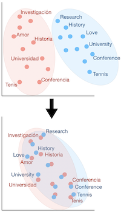
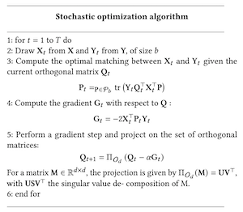
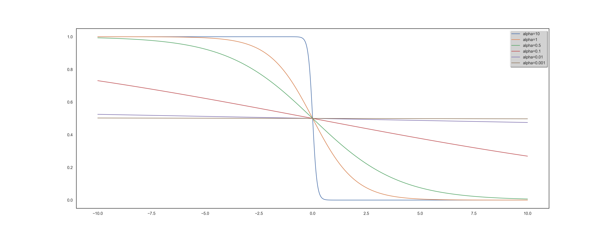

# Semi-Supervised Learning for Bilingual Lexicon Induction

This blog post contains an introduction to Unsupervised Bilingual Alignment and Multilingual Alignment. We also go through the theoretical framework behind Learning to Rank, and discuss how it migh help to produce better alignments in a Semi-Supervised fashion. 

This post was written with [Gauthier Guinet](https://www.linkedin.com/in/gauthier-guinet/) and was initially suppose to explore the impact of learning to rank to Unsupevised Translation.

We both hope that this post will serve as a good introduction to anyone interested in this topic.

#Introduction

Word vectors are conceived to synthesize and quantify semantic nuances, using a few hundred coordinates. These are generally used in downstream tasks to improve generalization when the amount of data is scarce. The widespread use and successes of these "word embeddings" in monolingual tasks has inspired further research on the induction of multilingual word embeddings for two or more languages in the same vector space. 

### add simple image 

The starting point was the discovery [[4]](https://papers.nips.cc/paper/5021-distributed-representations-of-words-and-phrases-and-their-compositionality.pdf) that word embedding spaces have similar structures across languages, even when considering distant language pairs like English and Vietnamese. More precisely, two sets of pre-trained vectors in different languages can be aligned to some extent: good word translations can be produced through a simple linear mapping between the two sets of embeddings. As an example, learning a direct mapping between Italian and Portuguese leads to a word translation accuracy of 78.1% with a nearest neighbor (NN) criterion.

### add image example of such mapping

Embeddings of translations and words with similar meaning are close (geometrically) in the shared  cross-lingual vector space. This property makes them very effective for cross-lingual Natural Language Processing (NLP) tasks.
The simplest way to evaluate the result is the Bilingual Lexicon Induction (BLI) criterion, which designs the percentage of the dictionary that can be correctly induced. 
Thus, BLI is often the first step towards several downstream tasks such as Part-Of-Speech (POS) tagging, parsing, document classification, language genealogy analysis or (unsupervised) machine translation.

Frequently, these common representations are learned through a two-step process, whether in a bilingual or multilingual setting. First, monolingual word representations are learned over large portions of text; these pre-formed representations are actually available for several languages and are widely used, such as the Fasttext Wikipedia vectors used in this work. Second, a correspondence between languages is learned in three ways: in a supervised manner if parallel dictionaries or data are available to be used for supervisory purposes, with minimal supervision, for example by using only identical strings, or in a completely unsupervised manner.

### image example of fasttext + add reference

It is common practice in the literature on the subject to separate these two steps and not to address them simultaneously in a paper. Indeed, measuring the efficiency of the algorithm would lose its meaning if the corpus of vectors is not identical at the beginning. We will therefore use open-source data from Facebook containing embeddings of several dozen languages computed using Wikipedia data. The fact that the underlying text corpus is identical also helps to reinforce the isomorphic character of the point clusters.

### add reference to the facebook paper

Concerning the second point, although three different approaches exist, they are broadly based on the same ideas: the goal is to identify a subset of points that are then used as anchors points to achieve alignment. In the supervised approach, these are the words for which the translation is available. In the semi-supervised approach, we will gradually try to enrich the small initial corpus to have more and more anchor points. The non-supervised approach differs because there is no parallel corpus or dictionary between the two languages. The subtlety of the algorithms will be to release a potential dictionary and then to enrich it progressively. 

We will focus in the following work on this third approach. Although it is a less frequent scenario, it is of great interest for several reasons. First of all, from a theoretical point of view, it provides a practical answer to a very interesting problem of information theory: given a set of texts in a totally unknown language, what information can we retrieve? The algorithms we chose to implement contrast neatly with the classical approach used until now. Finally, for very distinct languages or languages that are no longer used, it is true that the common corpus can be very thin. 

Many developments have therefore taken place in recent years in this field of unsupervised bilingual lexicon induction. One of the recent discoveries, which pushed us to do this project, is the idea that using information from other languages during the training process helps improve translating language pairs. We came across this idea while searching for multi-alignment of languages instead of bi-alignment. 

### add image of informations between 3 different languages

We chose to approach the problem in a different way, keeping an unsupervised alignment basis however.  We asked ourselves to what extent we could integrate the knowledge of a given set of languages when learning a new one, without having parallel data for the latter. The scenario of multi-alignment unsupervised assumes that there is no parallel data for all language pairs. We think it is more realistic and useful to assume that we do not have this data only for the last language. 

The underlying learning theme led us to formulate the problem as follows: **is it possible to gain experience in the progressive learning of several languages?** In other words, how can we make good use of the learning of several acquired languages to learn a new one? To our knowledge, this problem has never yet been addressed in the literature on the subject. This new formulation led us to consider the lexicon induction as a ranking problem for which we used recent tools of this machine learning field called Learning to Rank. 

In summary, this paper make the following main contributions:

* We present a new approach for the unsupervised bilingual lexicon induction problem that consistently outperforms state-of-the-art methods on several language pairs. On a standard word translation retrieval benchmark, using 200k vocabularies, our method reaches 95.3% accuracy on English-Spanish while the best unsupervised approach is at 84.1%. By doing this, we set a new benchmark in the field. 
* We conduced a study on the impact of the idioms used for the learning and for the prediction step, allowing us to have a better core understanding of our approach and to forecast the efficiency for a new idiom. 
* Our results further strengthen in a new way the strong hypothesis that word embedding spaces have similar structures across languages. [[4]](https://papers.nips.cc/paper/5021-distributed-representations-of-words-and-phrases-and-their-compositionality.pdf)

We will proceed as follows:  Sections ~\ref{sec:state_art} and ~\ref{sec:eval_mtri} will outline  the state of the art and the different techniques used for unsupervised learning in this context. In particular, we will explain the Wasserstein Procustes approach for bilingual and multi alignment. We then emphasize the lexicon induction given the alignment. Section ~\ref{sec:ltr} presents the Learning to Rank key concepts alongside the TensorFlow framework used in our main algorithm. Section ~\ref{sec:semi_sup} describes our program, the different subtleties and the key parameters. Finally, Section ~\ref{sec:results} presents the experimental results we obtained.

%Finally, Section ~\ref{sec:software} highlights software resources that accompany this text. 

# Unsupervised Bilingual Alignement

In this section, we provide a brief overview of unsupervised bilingual alignment methods to learn a mapping between two sets of embeddings. The majority are divided into two stages: the actual alignment and lexicon induction, given the alignment. Even if the lexicon induction is often taken into account when aligning (directly or indirectly, through the loss function), this distinction is useful from a theoretical point of view. 



<center>
<em>
Word embeddings alignment (in dimension 2).
</em>
</center>
<br/>

Historically, the problem of word vector alignment has been formulated as as a quadratic problem.
This approach, resulting from the supervised literature then allowed to presume the absence of lexicon without modifying to much the framework. That is why we will deal with it first in what follows. 


##Orthogonal Procrustes Problem

### add subtitles or schema

Procustes is a method that aligns points if given the correspondences between them (supervised scenario).
 and  are the two sets of word embeddings or points and we suppose, as previously said, that we know which point **X** corresponds to which point **Y**. This leads us to solve the following least-square problem of optimization, looking for the **W** matrix performing the alignment [[5]](https://arxiv.org/pdf/1805.11222.pdf):

<p align="center">
  
</p>

We have access to a closed form solution with a cubic complexity. 
Restraining **W** to the set of orthogonal matrices , improves the alignments for two reasons: it limits overfitting by reducing the size of the minimization space and allows to translate the idea of keeping distances and angles, resulting from the similarity in the space structure. The resulting problem is known as Orthogonal Procrustes and it also admits a closed form solution through a singular value decomposition (cubic complexity).

Thus, if their correspondences are known, the translation matrix between two sets of points can be inferred without too much difficulties. The next step leading to unsupervised learning is to discover these point correspondences using Wasserstein distance.


## Wasserstein Distance

### add subtitles or schema

In a similar fashion, finding the correct mapping between two sets of word can be done by solving the following minimization problem: 

<p align="center">
  
</p>

 containing all the permutation matrices, the solution of the minimization,  will be an alignment matrix giving away the pair of words. This 1 to 1 mapping can be achieved thanks to the Hungarian algorithm.
It is equivalent to solve the following linear program: 
<p align="center">
  
</p>

The combination of the Procustes- Wasserstein minimization problem is the following:

<p align="center">
  
</p>

In order to solve this problem, the approach of [[5]](https://arxiv.org/pdf/1805.11222.pdf) was to use a stochastic optimization algorithm. 
As solving separately those 2 problems was leading to bad local optima, their choice was to select a smaller batch of size *b*, and perform their minimization algorithm on these sub-samples. The batch is playing the role of anchors points. Combining this with a convex relaxation for an optimal initialization, it leads to the following algorithm:



## Other unsupervised approaches

Other approaches exist but they are currently less efficient than the one described above for various reasons: complexity, efficiency... We will briefly describe the two main ones below.

**Optimal transport:**

### schema to add

Optimal transport [[6]](https://people.math.gatech.edu/~gangbo/Cedric-Villani.pdf) formalizes the problem of finding a minimum cost mapping between two word embedding sets, viewed as discrete distributions. More precisely, they assume the following distributions:

<p align="center">
  
</p>

and look for a transportation map realizing:

<p align="center">
  
</p>

where the cost  is typically just  and  implies that the source points must exactly map to the targets. Yet, this transportation not always exist and a relaxation is used. Thus, the discrete optimal transport (DOT) problem consists of finding a plan  that solves

<p align="center">
  
</p>

where , e.g.,  is the cost matrix and the total cost induced by  is:

<p align="center">
  
</p>

where  belongs to the polytope 

A regularization is usually added, mostly through the form of an entropy penalization:

<p align="center">
  
</p>

Some works [[7]](https://www.aclweb.org/anthology/D18-1214/) are  based on these observations and then proposes algorithms, effective in our case because they adapt to the particularities of word embeddings. However, we notice that even if the efficiency is higher, the complexity is redibitive and does not allow the use of large vocabularies. Moreover, the research is more and more oriented towards an improvement of the algorithm described above with optimal transport tools rather than towards a different path. This is why we will not focus in particular on this track. We should however note the use of Gromov-Wasserstein distance [[8]](https://www.springer.com/gp/book/9780817645823), which allows to calculate in an innovative way the distance between languages, although they are in distinct spaces, enabling to compare the metric spaces directly instead of samples across the spaces.

**Adversarial Training:**
    Another popular alternative approach derived from the literature on generative adversarial network [[9]](https://arxiv.org/pdf/1406.2661.pdf) is to align point clouds without cross-lingual supervision by training a discriminator and a generator [[10]](https://arxiv.org/pdf/1710.04087.pdf). The discriminator aims at maximizing its ability to identify the origin of an embedding, and the generator of **W** aims at preventing the discriminator from doing so by making **WX** and **Y** as similar as possible.
They note  the discriminator parameters and consider the probability  that a vector  is the mapping of a source embedding (as opposed to a target embedding) according to the discriminator. 
The discriminator loss can then be written as:

<p align="center">
  
</p>

On the other hand, the loss of the generator is:

<p align="center">
  
</p>
    
For every input sample, the discriminator and the mapping matrix W are trained successively with stochastic gradient updates to respectively minimize  . 
Yet, papers [[10]](https://arxiv.org/pdf/1710.04087.pdf) on the subject show that, although innovative, this framework is more useful as a pre-training for the classical model than as a full-fledged algorithm. Hence our choice not to explore in more details this avenue. 

## Multilingual alignment

A natural way to improve the efficiency of these algorithms is to consider more than 2 languages.
Thus, when it comes to aligning multiple languages together, two principle approaches quickly come to mind and correspond to two types of optimization problems:

* Align all languages to one pivot language, often English, without taking into account for the loss function other alignments. This leads to low complexity but also to low efficiency between the very distinct language, forced to transit through English. 
* Align all language pairs, by putting them all in the loss function, without giving importance to any one in particular. If this improves the efficiency of the algorithm, the counterpart is in the complexity, which is very important because it is quadratic in the number of languages.

A trade-off must therefore be found between these two approaches.

Let us consider  word embeddings for each language *i*, *i*=0 can be considered as the reference language,  is the mapping matrix we want to learn and  the permutation matrix. The alignment of multiple languages using a reference language as pivot can be resumed by the following problem:

<p align="center">
  
</p>

As said above, although this method gives satisfying results concerning the translations towards the reference language, it provides poor alignment for the secondary languages between themselves.

Therefore an interesting way of jointly aligning multiple languages to a common space has been brought through by Alaux et al. [[11]](https://arxiv.org/pdf/1811.01124.pdf).

The idea is to consider each interaction between two given languages, therefore the previous sum becomes a double sum with two indexes *i* and *j*. To prevent the complexity from being to high and in order to keep track and control over the different translations, each translation between two languages is given a weight :

<p align="center">
  
</p>

The choice of these weights depends on the importance we want to give to the translation from language *i* to language *j*. 

The previous knowledge we have on the similarities between two languages can come at hand here, for they will have a direct influence on the choice of the weight. However choosing the appropriate weights can be uneasy. For instance giving a high weight to a pair of close languages can be unnecessary and doing the same for two distant languages can be a waste of computation. In order to reach this minimization effectively, they use an algorithm very similar to the stochastic optimization algorithm described above. 

At the beginning, we wanted to use this algorithm to incorporate exogenous knowledge about languages to propose constants  more relevant and leading to greater efficiency. Different techniques could result in these parameters: from the mathematical literature such as the Gromov-Wasserstein distance evoked above or from the linguistic literature, using the etymological tree of languages to approximate their degree of proximity or even from both. In the article implementing this algorithm, it is however specified that the final  are actually very simple: they are N if we consider a link to the pivot or 1 otherwise. Practical simulations have also led us to doubt the efficiency of this idea. This is why we decided to focus on the idea below that seemed more promising rather than on multialignments. 

# Word translation as a retrieval task: Post-alignment Lexicon Induction

The core idea of the least-square problem of optimization in Wasserstein Procustes is to minimize the distance between a word and its translation. Hence, given the alignment, the inference part first just consisted in finding the nearest neighbors (NN). Yet, this criterion had a mayor issue:
Nearest neighbors are by nature asymmetric: y being a K-NN of x does not imply that x is a K-NN of y. In high-dimensional spaces, this leads to a phenomenon that is detrimental to matching pairs based on a nearest neighbor rule: some vectors, called hubs, are with high probability nearest neighbors of many other points, while others (anti-hubs) are not nearest neighbors of any point. [[12]](https://arxiv.org/abs/1412.6568)

### add example

Two solutions to this problem have been brought through new criteria, aiming at giving similarity measure between two embeddings, thus allowing to match them appropriately. Among them, the most popular is Cross-Domain Similarity Local Scaling (CSLS) [[10]](https://arxiv.org/pdf/1710.04087.pdf). Other exist such as Inverted Softmax (ISF)[[13]](https://arxiv.org/pdf/1702.03859.pdf), yet they usually require to estimate noisy parameter in an unsupervised setting where we do not have a direct cross-validation criterion. 

The idea behind CSLS is quite simple: it is a matter of calculating a cosine similarity between the two vectors, subtracting a penalty if one or both of the vectors is also similar at many other points. More formally, we denote by  the neighboors of  for the target language, after the alignment (hence the presence of ).  Similarly we denote by  the neighborhood associated with a word *t* of the target language. The penalty term we consider is the mean similarity of a source embedding  to its target neighborhood:

<p align="center">
  
</p>

where cos(...) is the cosine similarity. Likewise we denote by  the mean similarity of a target word  to its neighborhood. Finally, the CSLS is defined as:

<p align="center">
  
</p>

However, it may seem irrelevant to align the embedding words with the NN criterion metric and to use the CSLS criterion in the inference phase. Indeed, it creates a discrepancy between the learning of the translation model and the inference: the global minimum on the set of vectors of one does not necessarily correspond to the one of the other. This naturally led to modify the least-square optimization problem to propose a loss function associated with CSLS [[14]]() {bib27}. By assuming that word vectors are  normalized, we have  Similarly, we have 

Therefore, finding the *k* nearest neighbors of  among the elements of  is equivalent to finding the *k* elements of  which have the largest dot product with . This equivalent formulation is adopted because it leads to a convex formulation when relaxing the orthogonality constraint on . This optimization problem with the Relaxed CSLS loss (RCSLS) is written as:

<p align="center">
  
</p>

A convex relaxation can then be computed, by considering the convex hull of , i.e., the unit ball of the spectral norm. The results of the papers [[10]](https://arxiv.org/pdf/1710.04087.pdf) point out that RCSLS outperforms the state of the art by, on average, 3 to 4% in accuracy compared to benchmark. This shows the importance of using the same criterion during training and inference. 

Such an improvement using a relatively simple deterministic function led us to wonder whether we could go even further in improving performance. More precisely, considering Word translation as a retrieval task, the framework implemented was that of a ranking problem. In order to find the right translation, it was important to optimally rank potential candidates. This naturally led us to want to clearly define this ranking problem and to use the state of the art research on raking to tackle it. In this framework, the use of simple deterministic criteria such as NN, CSLS or ISF was a low-tech answer and left a large field of potential improvement to be explored. 

However, we wanted to keep the unsupervised framework, hence the idea of training the learning to rank algorithms on the learning of the translation of a language pair, English-Spanish for instance, assuming the existence of a dictionary. This would then allow us to apply the learning to rank algorithm for another language pair without dictionary, English-Italian for instance. Similarly to the case of CSLS, the criterion can be tested first at the end of the alignment carried out thanks to the Procustes-Wasserstein method. Then, in a second step, it can be integrated directly through the loss function in the alignment step. The following will quickly present the learning to rank framework in order to understand our implementation in more detail. 

# Learning to Rank

A ranking problem is defined as the task of ordering a set of items to maximize the utility of the entire set. Such a problem is widely studied in several domains such as Information Retrieval. For example, on Gmail, given a query "order amazon" and a list of received email, the task would be to send an ordered list of received email with the first one being the one we want to see. 

Another exaple would be on any e-commerce website, where given a query "iphone black case" and the list of products available, the return list should be ordered by probability of getting purchased. With these examples, one can start understanding why a ranking problem is different than a classification or a regression task. While their goal is to predict a class or a value, the ranking task needs to order an entire list, such that, the higher you are the more relevant you should be.

### add example 

## Theoretical framework

Let's start by diving into the theoretical framework of Learning to Rank. Let be a training set, where: 


*  is a vector, also defined as  where  is an item.
*  is a vector, also defined as  where  is a relevance labels.
*  is the space of all items.


Furthermore, we define an item  as a query-documents pair .

The goal is to find a scoring function  that would minimizes the following loss : 

<p align="center">
  
</p>

where  is a local loss function. 

One first et very important note is how  is defined. This could be done in two ways: 

* We consider  as a *univariate* scoring function, meaning that it can be decomposed into a per-item scoring function such as  with . We will have ![f(X) = [u(x_0), ... , u(x_n)]](https://render.githubusercontent.com/render/math?math=%5Cdisplaystyle+f%28X%29+%3D+%5Bu%28x_0%29%2C+...+%2C+u%28x_n%29%5D). 
* We consider  as a *multivariate* scoring function, meaning that each item is scored relatively to every other items in the set, with . This means that changing one item could change the score of the rest of the set.

While the first option is simpler to implement, the second one is much closer to the reality, as the relevance of an item often depends on the distribution its in. For example, the relevance of a item on an e-commerce query will always depend on what the website offers you next to it.

### add example

We now have to define some metrics in order to judge how good a ranking is. We start by defining the *Discounted Cumulativ Gain* (DCG) of a list:

<p align="center">
  
</p>

where: 

*  are the ground truth labels
*  is the rank of the j-th item in X
*  is the discount factor
*  is how much we want to go deep into the list. A low value of  means that we want to focus on how well ranked the start of our list is.

Most of the time however we want to compare this metric to the DCG obtained from the ground truth labels. We then define: 

<p align="center">
  
</p>

where  is the item permutations induced by Y.

## Loss functions

In

<p align="center">
  
</p>

we defined  as a loss function between two ordered set of items. One approach could be to use the metrics defined above, but as they are non-differentiable, this is not a faisible choice. Therefore, we have to come up with some sort of surrogate loss function, differentiable, and with the same goal as our metric. Before diving into the possible approaches, one must define what *pointwise*, *pairwise* and *listwise* loss functions are.

A pointwise loss will only compare one predicted label to the real one. Therefore, each item's label is not compared to any other informations. 
A pairwise loss will compare 2 scores from 2 items at the same time. With pairwise loss, a model will try to minimize the number of pairs that are in the wrong order relative to the true labels. 
A listwise loss can capture differences in scores throughout the entire list of items. While this is a more complex approach, it allows to compare each score against the others. 

Let's give an example for each sort of loss function, starting with a pointwise one. The sigmoid cross entropy for binary relevance labels can be defined as:

<p align="center">
  
</p>

where  and  is the predicted labels for each item from one model.

The pairwise logistic loss [[1]](https://papers.nips.cc/paper/3708-ranking-measures-and-loss-functions-in-learning-to-rank.pdf) is a pairwise loss function that compares if pair of items are ordered in the right order. We can define it as: 

<p align="center">
  
</p>

where  is the indicator function.

Finally, a listwise loss function like the Softmax cross-entropy [[2]](https://www.microsoft.com/en-us/research/wp-content/uploads/2016/02/tr-2007-40.pdf) can be defined as:

<p align="center">
  
</p>

All of these loss function are surrogates that tries to capture the goal of our metrics. Another approach would be to define a listwise loss function, as close as our metrics as possible. For example, one could try to build a differentiable version of the NDCG [[3]](https://www.microsoft.com/en-us/research/wp-content/uploads/2016/02/tr-2008-164.pdf)

### ApproxNDCG: a differentiable NDCG

Let's take a query , and define several useful functions: 

<p align="center">
  
</p>

the relevance of an item  regarding of the fixed query , and

<p align="center">
  
</p>

the position of  in the ranked list  and finally,  still represents the indicator function of the set . The idea is to use an differentiable approximation of the indicator function. One can show that we have the following approximation: 

<p align="center">
  
</p>

where  is a hyperparameter. 



<center>
<em>
Example of approximation of the Indicator function for various values of alpha.
</em>
</center>
<br/>

For a fixed query, we can re-define the DCG metric with the following equality : 

<p align="center">
  
</p>

We now have to get an approximation of the  function. The idea here is to get back to an indicator function since it is possible to compute them. We will be using the following equality : 

<p align="center">
  
</p>

where  is defined as the score given to  according to , and define an approximation of  with:

<p align="center">
  
</p>

We can now define our differentiable version of the DCG metric by using these approximations. 

# RUBI: Ranked Unsupervised Bilingual Induction

**Motivations:** Let's describe more precisely the functioning of our algorithm, denoted RUBI, although already mentioned in previous sections. Two points guided our approach:

* From a linguistic point of view, there is obviously a learning to learn phenomenon for languages. We observe that by assimilating the structure of the new language, its grammar and vocabulary to one of the already known languages, it is easier for us to create links that help learning.
It is the search for these links that motivates us and we are convinced that they can be useful when inferring vocabulary. 
* Improvement induced by the use of the CSLS criterion suggests that there are complex geometrical phenomena (going beyond the above-mentioned existence of hubs) within the representations of languages, both ante and post-alignment. Understanding these phenomena can lead to greatly increased efficiency. 

**Framework:** Our goal is the same as for unsupervised bilingual alignment: we have a source language A and a target language B with no parallel data between the two. We want to derive an A-B dictionary, a classic BLI task. The specificity of our study is to assume that we also have a C language and an A-C dictionary at our disposal. To set up the learning to learn procedure, we proceed in 2 steps:

* **Learning:** Using the Procustes-Wasserstein algorithm, we align languages A and C in an unsupervised way. We then build a corpus of queries between the words from language A known from our dictionary and their potential translation into language C. Classical methods proposed the translation that maximized the NN or CSLS criteria. In our case, we use deep learning as part of our learning to rank framework to find a more complex criterion. One of the innovative features of our work is therefore to allow access to a much larger class of functions for the vocabulary induction stage. A sub-part of the dictionary is used for cross-validation. The way of rating the relevance of the potential translations, the inputs of the algorithm, the loss functions are all parameters that we studied and that are described in the next section. 
* **Prediction:**  We thus have at the end of the training an algorithm taking as input a vocabulary word, in the form of an embedding as well as a list of potential translations. The output of our algorithm is the list sorted according to the learned criteria of these possible translations, the first word corresponding to the most probable translation and so on. We first perform the alignment of languages A and B using again the Procustes-Wasserstein algorithm. In a second step, thanks to the learning to rank, we perform the lexicon induction step. 

Finally, a final conceptual point is important to raise. In the context of the CSLS criterion, we have seen in the above that its use after alignment has improved. However, actually incorporating it in the alignment phase by modifying the loss function has allowed for greater consistency and a second improvement. However, these two changes were separated. Yet, the learning to rank framework is quite different. The main reason is the non-linearity resulting from deep-learning, unlike CSLS. The global optimization is therefore much more complex and does not allow a relaxation to get back to a convex case. However, it is an area for improvement to be considered very seriously for future work. 

# Results


# References

[1]: CHEN, WEI, YAN LIU, TIE, LAN, YANYAN, MING MA, ZHI & LI, HANG 2009 Ranking measures and loss functions in learning to rank. In Advances in Neural Information Processing Systems 22 (ed. Y. Bengio, D. Schuurmans, J. D. Lafferty, C. K. I. Williams & A. Culotta), pp. 315–323. Curran Associates, Inc

[2]: CAO, ZHE, QIN, TAO, LIU, TIE-YAN, TSAI, MING-FENG & LI, HANG 2007 Learn- ing to rank: From pairwise approach to listwise approach. In Proceedings of the 24th International Conference on Machine Learning, pp. 129–136. New York, NY, USA: ACM.

[3]: QIN et al. A general approximation framework for direct optimization of information retrieval measures.

[4]: Ilya Sutskever, Thomas Mikolov, Kai Chen, Greg Corrado, Jeffrey Dean 2013. Distributed Representations of Words and Phrases and their Compositionality

[5]: Quentin Berthet, Edouard Grave and Armand Joulin: Unsupervised Alignment of Embeddings with Wasserstein Procrustes, 2018

[6]: Cédric Villani. Topics in optimal transportation. Number 58. American Mathematical Soc., 2003.

[7]: David Alvarez-Melis and Tommi Jaakkola. Gromov-wasserstein alignment of word embedding spaces. In Proceedings of the 2018 Conference on Empirical Methods in Natural Language Processing, 2018.

[8]: Mikhail Gromov. Metric structures for Riemannian and non-Riemannian spaces. Springer Science & Business Media, 2007.

[9]: Ian Goodfellow, Jean Pouget-Abadie, Mehdi Mirza, Bing Xu, David Warde-Farley, Sherjil Ozair, Aaron Courville, and Yoshua Bengio. Generative adversarial nets. Advances in neural information processing systems, pp. 2672–2680, 2014.

[10]: Conneau, A., Lample, G., Ranzato, M., Denoyer, L., and Jégou, H: Word translation without parallel data, 2017

[11]: Jean Alaux, Edouard Grave, Marco Cuturi and Armand Joulin: Unsupervised hyperaligment for multilingual word embeddings, 2019

[12]: Georgiana Dinu, Angeliki Lazaridou, and Marco Baroni. Improving zero-shot learning by mitigating the hubness problem. International Conference on Learning Representations, Workshop Track, 2015.

[13]: Smith, S. L., Turban, D. H., Hamblin, S., and Hammerla, N. Y.: Bilingual word vectors,
orthogonal transformations and the inverted softmax., 2017

# [Github Repository](https://github.com/Gguinet/semisupervised-alignement)


# semisupervised-alignement

## Instructions for google collab

**Settings for Virtual Machine:**

* europe-west2-c (London)
* 8 precesseurs virtuels, n1-highmem-8, haute capacité de mémoire
* Ubuntu, Version 18.04, 200 Go mémoire
* Pare-feu: Autoriser traffic HTTPS et HTTP

**Ligne de commande:**

```
sudo apt install python
sudo apt-get install python3-distutils
sudo curl "https://bootstrap.pypa.io/get-pip.py" -o "get-pip.py"
python3 get-pip.py
python3 -m pip install numpy tensorflow_ranking POT pandas sklearn 
git clone https://github.com/Gguinet/semisupervised-alignement.git ("Entrer compte et mdp git")
cd semisupervised-alignement
sh main.sh
```

**Instructions Python:**

```
python3 query_extraction.py --src_emb_train "${output_src1}" --tgt_emb_train "${output_tgt1}" \
    --src_emb_test "${output_src2}" --tgt_emb_test "${output_tgt2}" --output_dir 'query/' \
    --dico_train "${dico_train}" --dico_valid "${dico_valid}" --dico_test "${dico_test}" \
    --query_size 10 --query_relevance_type 'binary' --add_csls_coord false \
    --k_csls 10 --add_word_coord false --add_query_coord false 

python3 tf_ranking_libsvm.py --train_path 'query/train' --vali_path 'query/valid' \
    --test_path 'query/test' --output_dir 'tf_res' --group_size 1 --loss "approx_ndcg_loss" \
    --num_train_steps 100000 --query_relevance_type 'binary' --query_size 10
```

**Code framework:**

* ```Ablation_study``` collects the bash codes associated with the ablation tests.
* ```bli.sh``` takes as input two languages and run all the framework
* ```lang_impact.sh``` and ```lang_variation.sh``` run simulations for all languages
* ```main.sh``` is the older version of ```bli.sh```
* ```main_pre_align.sh``` and ```pre_alignment.sh``` are precomputing all the alignment for computations (to be deleted)
* ```query_extraction.py``` is extracting test, validation and training queries for two langues
* ```single_query_extract.py``` is only exctracting one query (usefull if re-use of query)
* ```query_aux.py``` is the auxiliary functions for query extraction
* ``tf_ranking_libsvm.py`` handle the learning to rank
* ``unsup_align.py`` is the facebook code for unsupervised alignment
* ``align.py`` and ``unsup_multialign.py`` are the supervised and multi alignment facebook code (not used)
* ``utils.py`` are auxiliary functions for alignment
